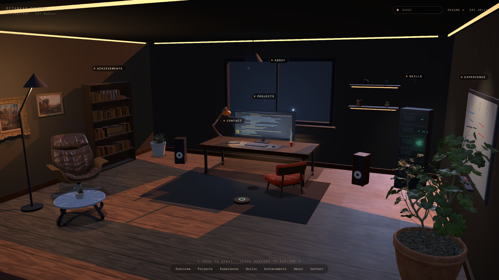

# Ritankar Mondal — Portfolio

An interactive 3D workspace. The portfolio is a room you orbit and explore: each object is a
section, and clicking one flies the camera to it and opens a full-screen world built around
that content.

**Live:** [ritankar-mondal.vercel.app](https://ritankar-mondal.vercel.app)



---

## Stack

| | |
|---|---|
| Framework | Next.js 15 (App Router), React 19, TypeScript |
| 3D | three.js `r185`, react-three-fiber 9, drei 10 |
| Post | `postprocessing` / `@react-three/postprocessing`, `n8ao` |
| Physics | `@react-three/rapier` |
| Motion | GSAP (camera flights), Framer Motion (DOM) |
| Styling | Tailwind v4 |
| Tooling | Playwright (visual verification), `@gltf-transform/cli` (asset pipeline) |

## Running it

```bash
npm install
npm run dev          # http://localhost:3000
npm run build
npm run bench        # frame-time benchmark, see bench/bench.mjs
```

Builds can target an isolated output directory so a verification build never interleaves
artifacts with a running dev server:

```bash
NEXT_DIST_DIR=.next-verify npm run build
NEXT_DIST_DIR=.next-verify npx next start -p 3177
```

---

## Architecture

### Rendering: quality tiers

`src/lib/gpuTier.ts` classifies the GPU once at load — reading `WEBGL_debug_renderer_info`,
with ordered fallbacks for weak parts, integrated chips, software rasterizers and touch
devices — and resolves a single `QUALITY` table. Every consumer branches on named settings
rather than re-deriving `q === "high" ? …` at each call site.

### Resolution is display-relative, not absolute

r3f's `dpr` is measured against **CSS** pixels, so a fixed ceiling means something different
on every monitor. A hard `1.75` was 1.75× supersampling on a 1× display, 1.17× at 150%
Windows scaling, and **0.875× on a 2× panel** — rendering *below* native and upscaling.

`dprRange()` instead expresses the target relative to `devicePixelRatio`, capped by a
per-tier pixel budget so a 4K panel can't request a 13-megapixel target. The high tier holds
a constant **1.3× supersample** on every display shape tested:

| viewport | native DPR | supersample |
|---|---|---|
| 1920×1080 | 1× | 1.3 |
| 1536×864 | 1.25× | 1.3 |
| 1512×850 | 1.5× | 1.3 |
| 1280×720 | 2× | 1.3 |
| 2560×1440 | 1× | 1.3 |

### Post-processing

One `EffectComposer` per tier, with a multisampled scene target (4× on high). Two details
that matter more than they look:

- **SMAA runs at the ULTRA preset with a lowered edge threshold (0.02).** The stock 0.05 is
  tuned for bright content; this is a night scene where the window mullion, bookshelf and
  wall corners are all dark-on-dark at ~0.03–0.04 contrast. Every one of those edges was
  being discarded before the blending pass ever saw it.
- **Procedural shading is antialiased in-shader.** The monitor's code rows and the city
  panorama's window grid are drawn with derivative-based `aastep()` rather than `step()`.
  MSAA cannot help there — it multisamples geometry coverage but still shades once per
  pixel, so shading *inside* a surface aliases regardless of the post chain.

### Interaction

- `SceneObject` (`src/lib/interactive/`) wraps every interactive object: hover outline,
  name tag, cursor, and a click that flies the camera to a named view — or to a pose
  derived from the object's bounding sphere if it has no authored view.
- `cameraBus` + `CameraRig` own all camera motion. Views live in `src/config/camera.config.ts`
  and are aspect-aware (`resolveView`), so portrait viewports get their own framing.
- **Portals** (`src/lib/portal.ts`) are the section experiences: the camera dives toward the
  object, controls relax, and a full-screen DOM world fades in — a terminal for Skills, a
  book for Achievements, a constellation for About.
- **Projects is in-scene rather than a portal.** `MonitorScreen` pins a 1152×448 DOM desktop
  to the monitor's 1.44×0.56 plane via drei `Html transform`, so you use a small OS inside
  the room.

### Materials and textures

Almost everything is procedural. `src/lib/textures.ts` generates walnut, plaster, plank and
roof-panel maps at runtime from layered FBM noise; `src/lib/materials.ts` caches every
material and shared geometry so the room resolves to a handful of GPU programs.

The look is **deliberately stylized, not photoreal** — see the note at the top of
`src/config/theme.ts`. Metalness and clearcoat are the strongest photoreal cues in this
renderer, so every metal is barely metallic and quite rough, and imported GLTF assets are
clamped into the same grade at load (`stylizeAssetMaterials`) so photoscanned furniture
doesn't read as composited in from a different room.

### Asset pipeline

Models ship Draco-compressed with WebP textures (~25 MB of source → ~4 MB deployed). The
Draco decoder is self-hosted in `public/draco/`, so first load has no CDN dependency.

```bash
npx gltf-transform optimize in.glb out.glb \
  --compress draco --texture-compress webp --texture-size 1024 --simplify false
```

---

## Performance

Frame spikes were traced by ablation rather than guesswork — each suspect isolated
independently over a 200-step orbit at 1920×1080, using the `?fx=` override so all
measurements came from one build:

| config | p95 | p99 | worst | dropped |
|---|---|---|---|---|
| baseline | 21.4 ms | 28.4 ms | 276 ms | 5 |
| −reflector | 20.6 | 26.3 | 144 | 4 |
| −PCSS | 20.9 | 64.7 | 120 | 8 |
| −area light | 21.5 | 31.9 | 131 | 6 |
| −AO | 23.2 | 29.6 | 230 | 7 |
| −shadow drift | 20.3 | 28.0 | 159 | 5 |
| **all off** | **19.0** | **21.4** | **23** | **0** |

**No single feature was responsible.** Median is 16.7 ms in every row because rAF is
vsync-locked — it cannot show GPU load, so only p99 and worst carry signal. The scene simply
sat close enough to the frame budget that any heavy frame overran, so the fix had to be
cumulative too.

Shipped configuration drops the floor reflector (the only feature costing a whole second
scene pass per frame), PCSS, and the rectAreaLight, and freezes the sun so both shadow maps
bake once at mount instead of re-baking at 15 Hz forever.

**Result: p95 19.1 ms, p99 21.2 ms, worst 24 ms, zero dropped frames.**

Two other fixes worth noting, both found the same way:

- `AdaptiveDpr` was removed. It lowers `dpr` on render-loop regress, and OrbitControls
  regresses on every change — so it resized the entire post chain at the start and end of
  *every drag*, spending a 100–230 ms stall to save resolution during the one moment a stall
  is most visible.
- Resolution ladder rungs now require a 1.2× gap. A fixed 0.25 step produced adjacent rungs
  of 1.25 and 1.3, letting `PerformanceMonitor` oscillate between two visually identical
  resolutions and pay a reallocation each time.

---

## Debug flags

| flag | effect |
|---|---|
| `?quality=low\|medium\|high` | force a tier (also `localStorage.quality`) |
| `?fx=-reflect,-pcss,-area,-ao,-shadowdrift` | disable individual settings for profiling |

The tiers move several things at once, which makes them useless for attributing cost —
"medium is smoother than high" says nothing about *which* of the five differences paid for
it. `?fx=` turns each into an independent variable measurable in a single build.

---

## Project structure

```
src/
├─ app/                     Next.js entry, layout, page shell
├─ components/
│  ├─ canvas/               Canvas entry, DPR ladder, readiness probe
│  ├─ camera/               CameraRig, camera bus (GSAP flights)
│  ├─ scene/                Room shell, workspace assembly, exterior panorama
│  ├─ objects/              Every prop; models/ wraps the GLTF assets
│  ├─ lighting/             The whole lighting rig
│  ├─ effects/              Post chain, dust, sun shafts
│  ├─ experiences/          Full-screen portal worlds per section
│  ├─ os/                   The in-scene desktop on the monitor
│  └─ ui/                   Loading screen, dock, captions, audio
├─ config/                  Camera views, palette/theme
├─ content/                 Portfolio copy and section mapping
└─ lib/                     Tiers, materials, textures, portal + focus state,
                            interaction registry, motion vocabulary
```

`src/lib/design.ts` holds the single motion vocabulary — one easing set and one duration
scale. New timings pick the nearest step rather than inventing a number.

---

## Trade-offs

Deliberate, and reversible via the tier table:

- **No mirror floor, no PCSS, no area light, no sun drift.** Bought the frame budget above.
  Each is a one-line revert.
- **Not baked.** The reference technique for scenes like this is baking lighting in Blender
  and rendering with `MeshBasicMaterial` — near-zero GPU cost. It needs a dedicated bake UV
  channel on modeled geometry, and this room is procedural geometry authored in code, so
  there is no source scene to bake from. Baking would also cost the real-time monitor glow,
  Roomba LED and hover lighting.
- **The ceiling cove's bottom edge is not perfectly smooth.** A soft-edged variant was tried
  — brightness falling to zero across the cross-section so the boundary becomes shading
  rather than geometry — and looked worse: the falloff compresses below a pixel at that
  grazing angle and aliases into regular beads. See the note in `materials.ts`.

## Known issues

- Double-clicking the d20 on the shelf can occasionally fly the camera instead of rolling it
  — likely a raycast miss while the die spins and scales between pointerdown and pointerup.

---

## Verification

The scene is verified visually rather than by unit test, since visual output is the product.
Playwright drives headless Chromium with hardware GL (`--enable-gpu --use-angle=d3d11
--ignore-gpu-blocklist`); software rasterization times out on this scene. `bench/bench.mjs`
documents the frame-time methodology — warmup discarded, percentiles rather than means, and
both vsync-capped and uncapped passes.

## License

Content and imagery © Ritankar Mondal. 3D models are Poly Haven (CC0) and Khronos glTF
sample assets — see `public/models/README.md`.
